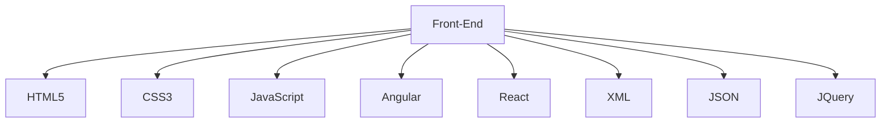
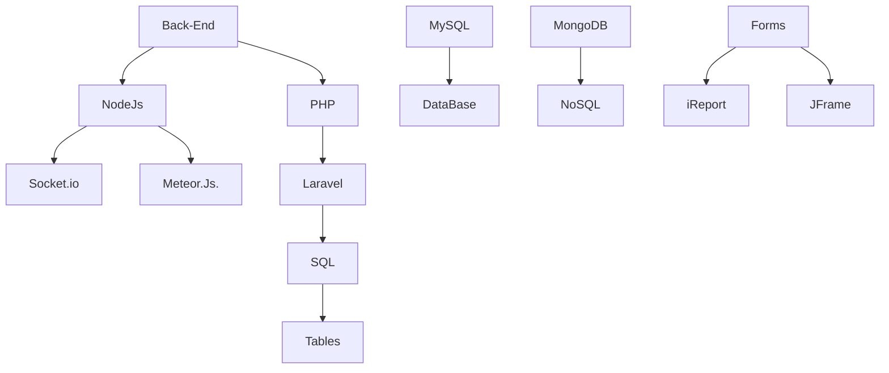

 

<div align="center">  
   
  

</div> 

<p align="center">
    <br/><br/><a href="https://www.linkedin.com/in/https://www.linkedin.com/in/arkiapps/" target="_blank"></a>
    <a href="https://www.facebook.com/https://www.facebook.com/melomdev/" target="_blank"></a>
    <a href="https://twitter.com/devcustomers" target="_blank"></a>
    <a href="https://www.instagram.com/https://www.instagram.com/melomdev/" target="_blank"></a>
    <a href="mailto:devscustomers@outlook.com" target="_blank"></a>
<p/>

<p align="center">
 
  

 
   
   
   
   
  
  
    
  
  
  
  
  
   
   
   
   
   
   
     
    
  
<p/>


[](https://github.com/melomdev/github-readme-activity-graph)






 ```geojson
{
  "type": "FeatureCollection",
  "features": [
    {
      "type": "Feature",
      "id": 1,
      "properties": {
        "ID": 0
      },
      "geometry": {
        "type": "Polygon",
        "coordinates": [
          [
              [-75.8814, 8.7486],
              [-75.8614, 8.7486],
              [-75.8614, 8.7286],
              [-75.8814, 8.7286],
              [-75.8814, 8.7486]
          ]
        ]
      }
    }
  ]
}

```
